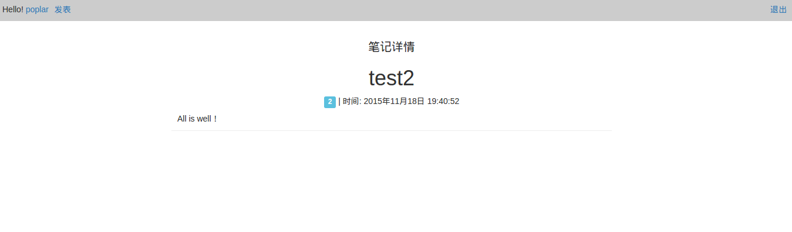

#基于 Node.js 的在线笔记

> *在线笔记：*使用 Node.js 及 web 应用框架 Express 搭建服务器， 配合 mongoDB 存储数据，使用 ejs 模板渲染前端页面的方式。
>
>具体的代码实现详见 [git-poplar](https://github.com/iPoplar/2015_Learn/tree/master/Learn4Road/Demo-NodeJs)
>该代码没有提交 node_modules，项目部署时执行命令 `npm install` 即可安装依赖模块。

> 该练习实现的基本功能：
> - 注册
> - 登录
> - 发布笔记
> - 笔记详情
> - 退出登录

实现截图如下：

*注册* 

*登录*

*发布笔记* 

*笔记详情*

