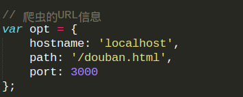
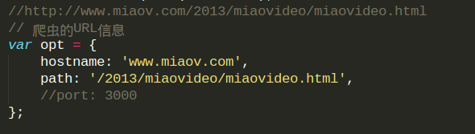
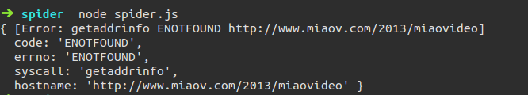

#GROTWTH-简单的网站信息爬虫

## Operation

> 通过Node.js实现一个简单爬虫，爬取豆瓣热门电影。主要会用到的模块（包）有：http，fs，path，cheerio。
> 这里用一个跑在本地的 http server 来模拟在线爬豆瓣网。
> douban-server.tar.gz 是有[实验楼](https://www.shiyanlou.com/)提供的在本地模拟豆瓣网的程序。

解压 douban-server.tar.gz 
```
tar zxvf douban-server.tar.gz
```
进入解压后的目录，启动服务:

```
npm start
```

创建文件夹 spider, 进入文件夹，输入 `npm init` , 初始化项目，会得到类似与小编的文件。（在初始化项目要添加第三方包 `npm install cheerio --save`）

运行 `node spider.js` 会抓取到想要的信息（将抓取到的图片放到 img 文件夹下，将电影信息放置在 data/data.json 中）

## Problems and growth

在小编现在的 spider.js 中的爬虫url信息如下图所示

当改为某个在线的网址，在此以妙味课堂的网址为例了

***那么在这里要要注意什么呢？***
1.*hostname* ,注意这两出的都没有 'http://' 部分，那么如果加了会怎么样呢？看下图喽：


2.*port* , 当抓取在线的网站的信息时，要记着去掉 port:3000, 不然又会有错：


3 要注意 host 和 path 的写法。对比前两幅图即可得。
 

